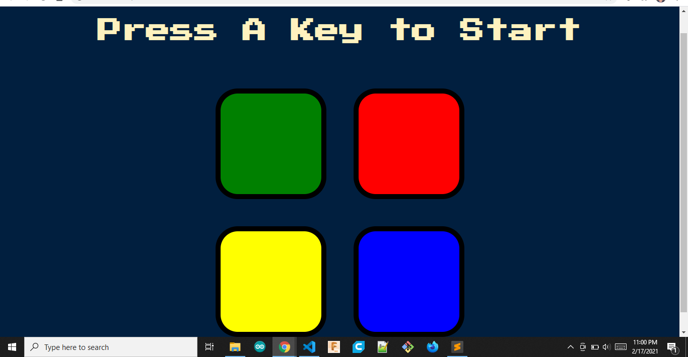

# Simon Game Challenge

> Memory game Website

## Table of contents

- [General info](#general-info)
- [Screenshots](#screenshots)
- [Technologies](#technologies)
- [Features](#features)
- [Status](#status)
- [Inspiration](#inspiration)
- [Contact](#contact)

## General info

simon Game is a memory game that gives a color patern randomly. The player should follow the patern given from the very first level upto the most recent.

## Screenshots

## Technologies

- HTML5
- CSS3
- JavaScript
- jQuery 3.5.1

## Features

List of features ready and TODOs for future development

- clickable colored buttons
- plays sound for each colored butons
- progresses level ifthe player enters the correct pattern.
- auto game refresh when any key was pressed.
- identify the current level of the user.

## Status

Project is finised.

## Inspiration

This is a Boss Level challenge project in Udemy Complete 2021 Web Development Bootcamp/Course (The App Brewery). This project showcases the javascript and jQuery combine to give behavior into the website.

## Contact

Created by [@gideon](linkedin.com/in/gideon-flores-8b598417a) - feel free to contact me!
